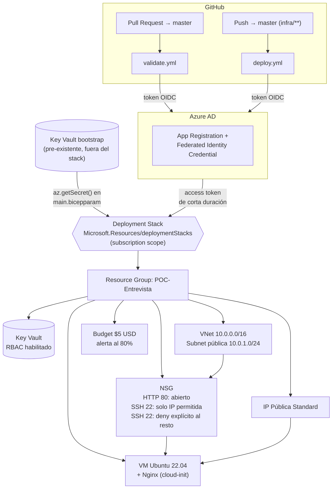

# POC Entrevista — Azure IaC con Bicep + Deployment Stacks

Proyecto de demostración para una entrevista técnica DevOps Cloud Azure Junior.
Despliega una VM Ubuntu con Nginx, red y seguridad de red, gestión de secretos
y control de costos — **todo como un único Azure Deployment Stack a nivel de
suscripción**, desplegado vía GitHub Actions con autenticación OIDC (sin
credenciales de larga duración).

## Arquitectura



## Estructura del repositorio

```
infra/
  main.bicep              # scope: subscription. Crea el RG y orquesta los módulos
  main.bicepparam         # valores fijos del POC + placeholders a completar
  modules/
    network.bicep          # VNet, subnet, NSG, IP pública, NIC
    compute.bicep           # VM Ubuntu + cloud-init (Nginx)
    keyvault.bicep           # Key Vault RBAC + secreto SSH + role assignment
    budget.bicep              # Budget mensual con alerta
    cloud-init.yaml            # user-data: instala y arranca Nginx
.github/workflows/
  validate.yml             # PR → master: bicep build + stack what-if
  deploy.yml               # push → master: az stack sub create
```

## Por qué un Deployment Stack y no un `az deployment` normal

Un `az deployment sub create` normal **aplica** cambios, pero no recuerda qué
recursos son "suyos". Si borras un recurso del Bicep, el recurso real sigue
vivo en Azure (drift). Y si quieres destruir todo, tienes que borrar cada
recurso a mano o llevar tu propio inventario.

Un **Deployment Stack** (`Microsoft.Resources/deploymentStacks`) sí lleva ese
inventario: agrupa todos los recursos desplegados por la plantilla como una
única unidad gestionada, con dos beneficios clave para este POC:

- **`--action-on-unmanage deleteAll`**: si un recurso se quita del Bicep, o se
  borra el stack completo, Azure Resource Manager elimina los recursos reales
  asociados. Es el equivalente directo a `aws cloudformation delete-stack` —
  borrar el stack borra absolutamente todo, incluido el propio Resource Group
  (porque el RG se crea *dentro* del Bicep, a nivel de suscripción).
- **`--deny-settings-mode denyWriteAndDelete`**: bloquea cualquier
  modificación o borrado manual de los recursos gestionados (incluso para un
  Owner en el portal), salvo por el propio pipeline. Esto fuerza que la única
  fuente de verdad sea el repo — nada de "cambios rápidos" en el portal que
  luego generan drift.

## Autenticación OIDC (sin secrets de larga vida)

GitHub Actions nunca tiene un client secret de Azure. En su lugar:

1. GitHub emite un **token OIDC de corta duración**, firmado por GitHub,
   vinculado a claims del propio workflow run (repo, branch/PR, environment).
2. `azure/login@v2` presenta ese token a Azure AD.
3. Azure AD valida el token contra una **Federated Identity Credential**
   configurada en el App Registration del pipeline, y si el `subject` coincide
   (ver más abajo), emite un access token de Azure AD de minutos de duración.
4. Ese token es lo que usa `az stack sub create` — nunca se almacena ni se
   reutiliza fuera del job.

### Si aún no tienes el App Registration con federated credentials

```bash
# 1. Crear el App Registration
az ad app create --display-name "poc-entrevista-github-oidc"
APP_ID=$(az ad app list --display-name "poc-entrevista-github-oidc" --query "[0].appId" -o tsv)

# 2. Crear el Service Principal asociado
az ad sp create --id "$APP_ID"
SP_OBJECT_ID=$(az ad sp show --id "$APP_ID" --query id -o tsv)

# 3. Asignar Contributor sobre la suscripción (o un scope más acotado si prefieres)
SUBSCRIPTION_ID=$(az account show --query id -o tsv)
az role assignment create \
  --assignee "$APP_ID" \
  --role "Contributor" \
  --scope "/subscriptions/$SUBSCRIPTION_ID"

# 4. Federated credential para Pull Requests (usada por validate.yml)
az ad app federated-credential create --id "$APP_ID" --parameters '{
  "name": "poc-entrevista-pr",
  "issuer": "https://token.actions.githubusercontent.com",
  "subject": "repo:<TU_ORG>/<TU_REPO>:pull_request",
  "audiences": ["api://AzureADTokenExchange"]
}'

# 5. Federated credential para push a master (usada por deploy.yml)
az ad app federated-credential create --id "$APP_ID" --parameters '{
  "name": "poc-entrevista-master",
  "issuer": "https://token.actions.githubusercontent.com",
  "subject": "repo:<TU_ORG>/<TU_REPO>:ref:refs/heads/master",
  "audiences": ["api://AzureADTokenExchange"]
}'
```

> `$SP_OBJECT_ID` es el **Object ID** del Service Principal (no el `appId`).
> Es el valor que debes usar tanto en el secret `AZURE_PIPELINE_PRINCIPAL_ID`
> como en el parámetro `pipelinePrincipalId` — confundir Object ID con
> Application ID es el error más común al configurar esto.

### Secrets a crear en el repo de GitHub

```bash
gh secret set AZURE_CLIENT_ID --body "$APP_ID"
gh secret set AZURE_TENANT_ID --body "$(az account show --query tenantId -o tsv)"
gh secret set AZURE_SUBSCRIPTION_ID --body "$SUBSCRIPTION_ID"
gh secret set AZURE_PIPELINE_PRINCIPAL_ID --body "$SP_OBJECT_ID"
```

Si ya tienes un App Registration con federated credentials existente, solo
necesitas repetir los pasos 4-5 (agregar los `subject` de este repo) y cargar
los 4 secrets de arriba con sus valores actuales.

## SSH key: nunca en el repo, protegida por Key Vault + RBAC

La SSH public key jamás se escribe en texto plano ni en el repo ni en un
GitHub secret. El flujo es:

1. **Bootstrap** (una sola vez, fuera del stack): un Key Vault pequeño y
   pre-existente guarda tu SSH public key como secreto.
2. **`infra/main.bicepparam`** resuelve el parámetro `sshPublicKey` en tiempo
   de despliegue con la función `az.getSecret()` de Bicep, apuntando a ese
   Key Vault de bootstrap.
3. El **Key Vault gestionado por el stack** (`modules/keyvault.bicep`, con
   `enableRbacAuthorization: true` y sin access policies legacy) guarda esa
   misma clave como secreto — como parte de los recursos versionados/borrados
   junto con el resto del POC — y le otorga el rol **Key Vault Secrets User**
   (solo lectura de secretos, nada de administración del vault) al Service
   Principal del pipeline, con el scope acotado únicamente a ese vault.

### Por qué existe un Key Vault de "bootstrap" separado

El stack no puede leer un secreto desde un Key Vault que está creando en la
misma operación (problema del huevo y la gallina). Por eso el valor de origen
vive en un Key Vault mínimo, creado una sola vez y fuera del ciclo de vida del
stack; el Key Vault "real" del proyecto guarda una copia gestionada, auditable
y con RBAC, pero no es la fuente que alimenta el parámetro.

```bash
# Bootstrap: una sola vez, antes del primer despliegue
BOOT_RG="poc-entrevista-bootstrap"
BOOT_KV="poc-entrevista-boot-kv"   # debe ser único globalmente, ajusta si falla

az group create --name "$BOOT_RG" --location centralindia

az keyvault create \
  --name "$BOOT_KV" \
  --resource-group "$BOOT_RG" \
  --location centralindia \
  --enable-rbac-authorization true

# Otórgate a ti mismo el rol para poder cargar el secreto
az role assignment create \
  --assignee "$(az ad signed-in-user show --query id -o tsv)" \
  --role "Key Vault Secrets Officer" \
  --scope "$(az keyvault show --name $BOOT_KV --query id -o tsv)"

az keyvault secret set \
  --vault-name "$BOOT_KV" \
  --name "ssh-public-key" \
  --file ~/.ssh/id_ed25519.pub

# El Service Principal del pipeline también necesita leer este vault de
# bootstrap para que az.getSecret() se resuelva en CI:
az role assignment create \
  --assignee "$APP_ID" \
  --role "Key Vault Secrets User" \
  --scope "$(az keyvault show --name $BOOT_KV --query id -o tsv)"
```

Luego edita `infra/main.bicepparam` reemplazando `<SUBSCRIPTION_ID>`,
`<BOOTSTRAP_RESOURCE_GROUP>` y `<BOOTSTRAP_KEYVAULT_NAME>` por los valores de
arriba.

## Antes de desplegar

Solo hay que completar dos cosas:

1. **`sshSourceIp`** en `infra/main.bicepparam` — tu IP pública:
   ```bash
   curl -s ifconfig.me
   ```
   y arma el CIDR como `"<esa-ip>/32"`.
2. Los 3 placeholders del bootstrap Key Vault (sección anterior) en el mismo
   archivo.

## Validar un cambio grande antes de aplicarlo (local)

```bash
az stack sub create \
  --name poc-entrevista-stack \
  --location centralindia \
  --template-file infra/main.bicep \
  --parameters infra/main.bicepparam \
  --deny-settings-mode denyWriteAndDelete \
  --action-on-unmanage deleteAll \
  --confirm-with-what-if
```

Esto muestra el diff completo (qué se crea, modifica o **borra**, incluyendo
recursos que el stack eliminaría por haber salido del Bicep) y pide
confirmación interactiva antes de aplicar. Es el equivalente de
`terraform plan` + `apply` en un solo comando, pero con el `apply` gated por
tu confirmación manual.

## Destruir todo el ambiente

```bash
az stack sub delete \
  --name poc-entrevista-stack \
  --action-on-unmanage deleteAll \
  --yes
```

Borra el Resource Group `POC-Entrevista` completo (VM, red, NSG, Key Vault,
budget) y el propio registro del stack. No queda nada facturable atrás.

> El Key Vault gestionado tiene soft-delete habilitado (requisito de Azure) y
> `enablePurgeProtection: false`. Si vas a redesplegar rápido con el mismo
> nombre, puede que necesites purgarlo primero:
> `az keyvault purge --name <nombre-del-kv> --location centralindia`.

## Costo y región: por qué `centralindia`

`centralindia` es una de las regiones más económicas de Azure y tiene
disponibilidad confirmada de `Standard_B1s` y `Standard_B2ats_v2` para esta
suscripción. El trade-off es **latencia**: al estar físicamente lejos de
Chile, la latencia de red hacia la VM/Nginx será notoriamente alta (varios
cientos de ms). Para una demo de entrevista esto es aceptable — lo que importa
es demostrar el patrón de IaC, seguridad y control de costos, no servir
tráfico real de baja latencia. Si este fuera un ambiente productivo para
usuarios en Chile, la región correcta sería `brazilsouth` o `eastus`, a costa
de un mayor precio por hora de cómputo.

### Fallback de VM size sin fallar el despliegue

Por defecto se usa `Standard_B1s` (`infra/main.bicepparam` →
`vmSize`). Si al desplegar Azure reporta falta de cuota para esa SKU en
`centralindia` para tu suscripción, **no hace falta tocar el Bicep**: basta
con redesplegar sobrescribiendo el parámetro:

```bash
az stack sub create \
  --name poc-entrevista-stack \
  --location centralindia \
  --template-file infra/main.bicep \
  --parameters infra/main.bicepparam \
  --parameters vmSize=Standard_B2ats_v2 \
  --deny-settings-mode denyWriteAndDelete \
  --action-on-unmanage deleteAll \
  --yes
```

`Standard_B2ats_v2` es una SKU **arm64** (Ampere Altra), a diferencia de
`Standard_B1s` que es x64. `modules/compute.bicep` detecta esto
automáticamente a partir del nombre de la SKU (`contains(vmSize, 'ats')`) y
selecciona la imagen de Ubuntu 22.04 arm64 en vez de la x64 — no se requiere
ningún parámetro adicional ni falla el despliegue por incompatibilidad de
arquitectura.

## Seguridad de red

- **HTTP (80)**: abierto a Internet — es el sitio que sirve Nginx.
- **SSH (22)**: permitido solo desde `sshSourceIp` (prioridad 110).
- **SSH (22) — deny explícito**: regla adicional (prioridad 120) que deniega
  SSH desde `Internet` para el resto de orígenes. El NSG ya deniega todo por
  defecto, pero esta regla lo hace explícito, auditable y a prueba de que
  alguien agregue después una regla `Allow *` demasiado amplia sin darse
  cuenta de que reabre SSH.
- Autenticación de la VM **solo por SSH key** (`disablePasswordAuthentication:
  true`) — no hay contraseña que filtrar.

## Fuera de alcance (a propósito)

Sin Terraform, sin Kubernetes, sin Private Endpoints, sin Azure Bastion, sin
Application Gateway/WAF. Es un proyecto acotado y demostrable en el tiempo de
una entrevista técnica, no un diseño de referencia productivo.
